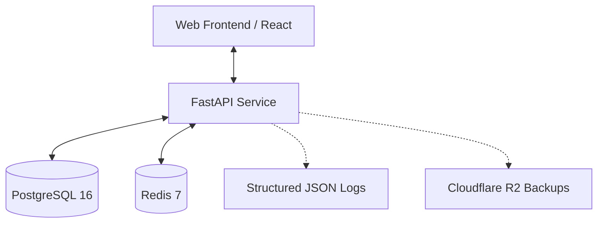

# Bon Bon Oil ERP

[](https://github.com/example/bon-bon-oil/actions)
[](https://github.com/example/bon-bon-oil/actions)
[](https://opensource.org/licenses/MIT)

A robust, enterprise-grade ERP system designed for specialized oil distribution businesses. This platform manages the entire lifecycle of voucher sales, inventory movements, production planning, customer credit, and financial accounting with a strong focus on data integrity, security, and auditability.

## 🏗️ System Architecture

The system follows a modern decoupled architecture designed for high availability and transactional consistency:



- **Frontend:** Responsive SPA built with React 19 and TypeScript, featuring offline support and multi-language (English/Burmese) capabilities.
- **Backend:** Asynchronous REST API built with FastAPI, utilizing SQLAlchemy 2.0 for persistence and Redis for idempotency and caching.
- **Integrity Layer:** Middleware-driven audit logging, idempotency protection, and transactional service patterns.

## 🚀 Key Features

### Core Modules
- **Voucher Management:** Full lifecycle tracking from draft to confirmation, payment, and voiding.
- **Inventory Engine:** Real-time stock movement tracking with an append-only ledger logic.
- **Production Planning:** Batch-based production with automatic raw material consumption and yield tracking.
- **Finance & Accounting:** Double-entry journal system, customer debt management, and flexible payment tracking.
- **Customer Portal:** Management of profiles, credit limits, and historical balances.

### System Capabilities
- **Audit Logging:** Automated capture of all state-changing operations for compliance.
- **Idempotency:** Protection against duplicate transactions using `X-Idempotency-Key`.
- **Offline Mode:** Frontend support for pending uploads and local data persistence.
- **RBAC:** Granular role-based access control (`super_admin`, `admin`, `manager`, `cashier`, `warehouse`).

## 🛠️ Tech Stack

### Backend
- **Core:** Python 3.13, FastAPI, Pydantic v2
- **Persistence:** PostgreSQL 16, SQLAlchemy 2.0 (Async), Alembic
- **Caching:** Redis 7
- **Quality:** Pytest, Mypy (Strict), Ruff

### Frontend
- **Core:** React 19, TypeScript, Vite 6
- **State & Data:** TanStack Query v5, Zustand
- **UI:** Tailwind CSS, Radix UI, Lucide Icons
- **i18n:** i18next (English + Burmese Unicode)

## 🏁 Getting Started

### Prerequisites
- **Docker & Docker Compose** (Recommended)
- **Node.js 20+**
- **Python 3.13** (For local development)

### 1. Environment Configuration

The system requires environment variables. Templates are provided in each directory:

```bash
# Backend
cd backend && cp .env.example .env

# Frontend
cd ../frontend && cp .env.example .env
```

> [!IMPORTANT]
> Use **demo values** (e.g., `demo_pass`) for local development. Never commit real secrets.

### 2. Launch Infrastructure

```bash
cd backend
make dev   # Starts API, Postgres, and Redis
```

### 3. Initialize System

In a separate terminal:

```bash
cd backend
make migrate      # Apply database schema
make seed         # Load reference data (Payment methods, etc.)
make superadmin   # Create the initial admin account
```

### 4. Start Frontend

```bash
cd frontend
npm install
npm run dev
```
Access the app at [http://localhost:5173](http://localhost:5173).

## 🛡️ Security & Integrity

- **Transactional Safety:** Every business operation is atomic; failures trigger full rollbacks.
- **Concurrency Control:** Pessimistic locking in critical paths (Inventory/Vouchers).
- **Audit Trails:** Every mutation is captured in `audit_logs` with full request context.
- **JWT Security:** Secure authentication using short-lived access tokens and refresh tokens.

## 📂 Repository Structure

```text
.
├── backend/                # FastAPI Application
│   ├── app/                # Application logic (modules, core, database)
│   ├── alembic/            # Database migrations
│   ├── scripts/            # Seeding and utility scripts
│   └── tests/              # Integration and unit tests
├── frontend/               # React Application
│   ├── src/                # Source code (features, components, api)
│   └── public/             # Static assets
└── README.md               # Unified System Documentation
```

## 📈 Quality & Testing

### Backend
```bash
cd backend
make test        # Run Pytest suite
make lint        # Run Ruff linter
make typecheck   # Run Mypy type checker
```

### Frontend
```bash
cd frontend
npm run lint     # Run ESLint
npm run build    # Verify production build
```

## 📄 License

Licensed under the MIT License. See `LICENSE` for details (if available).
